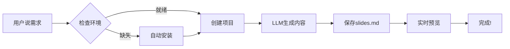

# Agent ✖️ MCP
## 动手实现一个做 PPT 的 MCP 服务器

---
layout: default
transition: slide-left
---

## 问题引入：研究人员的PPT困境

作为研究人员和工程师，我们总是需要：
- **组会报告** - 展示最新实验进展
- **工作汇报** - 向导师/领导汇报成果

但我们的PPT往往是：
- **极简风格** - 内容导向，不花哨
- **现场交互** - 主要靠讲，PPT是辅助

**那么问题**：能否让AI帮我们快速生成这种简约的研究型PPT？

---
layout: default
transition: slide-left
---

## 什么是Slidev？

专为开发者设计的现代化幻灯片工具：

- ✅ **基于Markdown** - 熟悉的语法
- ✅ **Vue.js驱动** - 高度可定制
- ✅ **实时预览** - 保存即更新
- ✅ **开发者友好** - 支持代码高亮

---
layout: default
transition: slide-left
---

## Slidev的三大痛点

### 1. 上手门槛高
需要记忆大量front-matter语法和转场配置

### 2. 编写过程繁琐
30页组会PPT需要手动插入29个分隔符`---`

### 3. 心智负担重
LaTeX公式、图表、主题配置分散在多个文件中

**结果**：时间都花在格式调整上，而不是思考内容

---
layout: default
transition: slide-left
---

## MCP解决方案：让AI写Slidev

::: figure-side

**左图：AI Agent工作流程**

**右文：一句话总结**

把"写PPT"变成"说需求"——
只需告诉AI你的研究内容，它自动帮你：
- ✨ 生成合适的页面结构
- 🎨 选择最佳的主题样式
- 📊 插入代码块和图表
- 🚀 启动在线预览

---
layout: default
transition: slide-left
---

## 实际效果展示

AI Agent生成的组会PPT示例：

- 📱 在线实时预览
- 🎯 内容精准匹配研究方向
- ⚡ 从大纲到成品只需30秒

---
layout: two-cols
transition: slide-left
---

## 结论：实验室效率革命

基于slidev-mcp，我们开发了：**slidev-ai**

一键生成研究型PPT：
- 🔬 **专注研究** - 把时间还给实验和思考
- ⚡ **极速生成** - 30秒完成30页组会PPT
- 🎓 **学术适配** - 专为研究人员优化

::right::

**AI时代，让PPT制作回归内容本身！**

---
layout: two-cols
transition: slide-left
---

## TODO

 

- [ ] 支持更多的主题

- [ ] 挂载附属 memory mcp 记住用户偏好
- [ ] 通过文生图自动为介绍部分添加说明图
- [ ] 图片自适应
- [ ] more imagination ...

---
layout: default
transition: slide-left
---

## Thanks

### Q&A

我的个人网站： https://kirigaya.cn/about

OpenMCP 官网： https://openmcp.kirigaya.cn

邮箱： 1193466151@qq.com

微信：

