# Agent × MCP
## 动手实现一个做 PPT 的 MCP 服务器

---
layout: default
transition: slide-left
---

## 问题引入：研究人员的PPT困境

作为研究人员和工程师，我们总是需要：
- **组会报告** - 展示最新实验进展
- **工作汇报** - 向导师/领导汇报成果

但我们的PPT往往是：
- **极简风格** - 内容导向，不花哨
- **现场交互** - 主要靠讲，PPT是辅助

**那么问题**：能否让AI帮我们快速生成这种简约的研究型PPT？

---
layout: two-cols
transition: slide-left
---

## 什么是Slidev？

专为开发者设计的现代化幻灯片工具：

- ✅ **基于Markdown** - 熟悉的语法

- ✅ **Vue.js驱动** - 高度可定制
- ✅ **实时预览** - 保存即更新
- ✅ **开发者友好** - 支持代码高亮


::right::

<br>


https://sli.dev/demo/starter

---
layout: default
transition: slide-left
---

## slidev 安装

安装 & 运行

```bash
npm i @slidev/cli -g
slidev slides.md --open
```

<v-click>

文件名：`slides.md`

```markdown
---
theme: academic
layout: cover
transition: slide-left
coverAuthor: 锦恢
coverAuthorUrl: https://kirigaya.cn/about
coverBackgroundUrl: https://cdn.jsdelivr.net/gh/slidevjs/slidev-covers@main/static/w68kZc0L69w.webp
---

# Agent × MCP
## 动手实现一个做 PPT 的 MCP 服务器
```

</v-click>

---
layout: default
transition: slide-left
---

## Slidev的三大痛点

<br>

### 1. 上手门槛高
需要记忆大量front-matter语法和转场配置

### 2. 编写过程繁琐
30页组会PPT需要手动插入29个分隔符`---`

### 3. 心智负担重
LaTeX公式、图表、主题配置分散在多个文件中

<v-click>

**结果**：时间都花在格式调整上，而不是思考内容

</v-click>

---
layout: default
transition: slide-left
---

## MCP解决方案：让AI写Slidev

<br>

基本思路

1. 根据 idea 设置出第一个版本的 mcp server

2. 测试工具完备性
3. 测试语义完备性
4. 迭代 mcp server（调整 mcp tool 设计和 mcp prompt），然后继续测试


<v-click>

> 留给你们一个小问题：为什么不直接让大模型生成整个 slidev，毕竟这玩意儿是纯文本。

</v-click>

---
layout: default
transition: slide-left
---

## MCP解决方案：让AI写Slidev


**AI Agent 工作流程**

```mermaid
flowchart LR
    A[用户说需求] --> B{检查环境}
    B -->|缺失| C[自动安装]
    B -->|就绪| D[创建项目]
    C --> D
    D --> E[LLM生成内容]
    E --> F[保存slides.md]
    F --> G[实时预览]
    G --> H[完成!]
```



**基本架构**

- slidev 设计为一个结构化的对象 `SlidevItem`

- slidev-mcp 管理 `SlidevItem` 数组
- 将对于 `SlidevItem` 数组 的增删改查逻辑，暴露为 mcp tool
- 语义引导暴露为一个 system prompt，基于测试不断迭代

[vscode 启动！](vscode://file/C:/Users/kirigaya/codes)

---
layout: default
transition: slide-left
---

## 实际效果

AI Agent生成的组会PPT示例：

- 📱 输入大纲和素材，通过纯自然语言交互快速拟定初稿
- ⚡ 从大纲到成品只需30秒


---
layout: two-cols
transition: slide-left
---

## 继续？光速迭代为产品！

基于slidev-mcp，我们开发了：**slidev-ai**

一键生成研究型PPT：
- 🔬 **专注研究** - 把时间还给实验和思考
- ⚡ **极速生成** - 30秒完成30页组会PPT
- 🎓 **学术适配** - 专为研究人员优化

[openmcp-sdk : 适用于 openmcp 的部署框架](https://kirigaya.cn/openmcp/zh/sdk-tutorial/)

::right::


**AI时代，让PPT制作回归内容本身！**

---
layout: two-cols
transition: slide-left
---

## TODO

<br>

- [ ] 支持更多的主题

- [ ] 挂载附属 memory mcp 记住用户偏好
- [ ] 通过文生图自动为介绍部分添加说明图
- [ ] 图片自适应
- [ ] more imagination ...

---
layout: two-cols
transition: slide-left
---

## Thanks


**Time for Q&A**

个人主页： https://kirigaya.cn/about

Github: https://github.com/LSTM-Kirigaya

OpenMCP 官网： https://openmcp.kirigaya.cn

邮箱： zhelonghuang@qq.com

::right::

<br>
<br>


