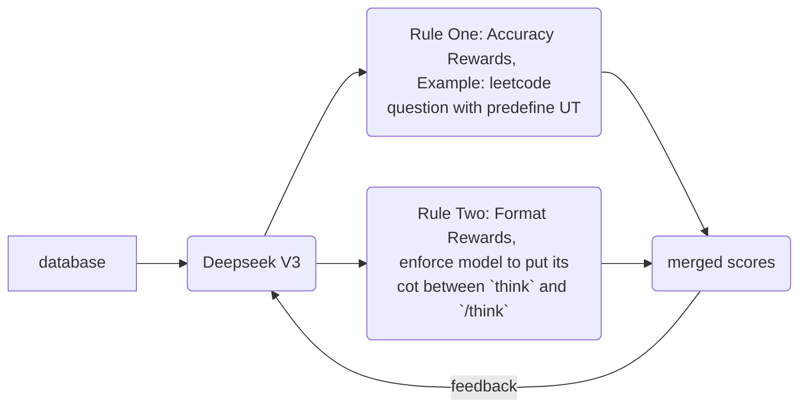
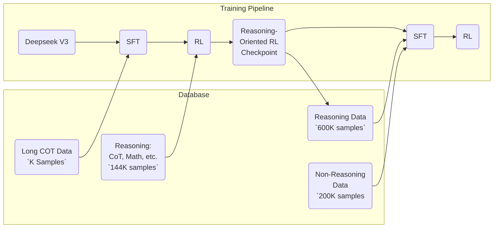

# Deepseek R1
## Incentivizing Reasoning Capability in LLMs via Reinforcement Learning

---
transition: slide-left
---

## Reinforcement learning from human feedback

---
transition: slide-left
---

## Motivation

OpenAI's o1 marks a breakthrough in the reasoning ability LLM

- O1 has reached the level of a human expert in solving competition problems
- O1 has initially explored the second stage of AGI (Reasoner)

---
transition: slide-left
---

## Motivation

Pre-training may be coming to an end, but the Scaling Law will continue?

The new paradigm introduced by o1: Scale computation in reinforcement learning and inference

---
transition: slide-left
---

## Background

Reasoning Model based on Reinforcement Learning

Agent   =>  LLM

Action  =>   Next Token / Step / Solution

State    =>   LLM inputs 

Policy  =>  $\pi(\text{action} | \text{state})$

---
transition: slide-left
---

## Related work

---
transition: slide-left
---

## Policy Init

### Pre-training

Acquire basic logical reasoning and analytical skills through a large amount of mathematical and code texts that are rich in logic

### Supervision Fine-tuning
Further injecting human-like reasoning behaviors, with the ability to explore complex solution spaces

---
transition: slide-left
---

## Reward Design

Learning reward signals from the environment or human labels

---
transition: slide-left
---

## Method

- DeepSeek-R1-Zero
    - Reinforcement Learning on the Base Model
- DeepSeek-R1
    - Reinforcement Learning with Cold Start

---
transition: slide-left
---

## DeepSeek-R1-Zero

Motivation: verify the effectiveness of inference(COT) in LLM training.

---
transition: slide-left
---

## PPO vs GRPO

### PPO

$$
\mathcal J_{PPO}(\theta) = \mathbb{E}_t \left[ \min\left( r_t(\theta) \hat{A}_t, \text{clip}(r_t(\theta), 1-\epsilon, 1+\epsilon) \hat{A}_t \right) \right]
$$

where

$$
r_t(\theta) = \frac{\pi_\theta (o_t | s_t)}{\pi_{\theta_{\text{old}}}(o_t | s_t)}
$$

### GRPO

$$
\mathcal J_{GRPO}(\theta) = \mathbb E\left[\sum_{i=1}^G\left(\min \left(\frac{\pi_\theta (o_i)}{\pi_{\theta_{\text{old}}}(o_i)}A_i, \mathrm{clip}(\frac{\pi_\theta (o_i)}{\pi_{\theta_{\text{old}}}(o_i)}, 1 - \epsilon, 1 + \epsilon)A_i\right) \\- \beta \mathbb D_{KL}(\pi_{\theta} || \pi_{ref})\right)\right]
$$

what you need to know

In large language models, GRPO removes the need for a separate value network, reducing memory and compute costs while aligning well with “comparative” Reward Model designs.

---
transition: slide-left
---

## Aha Moment

---
transition: slide-left
---

## DeepSeek-R1

Four step finetone

---
transition: slide-left
---

## Infra

### DP TP PP

> Colossal-AI: A Unified Deep Learning System For Large-Scale Parallel Training

---
transition: slide-left
---

## Dense -> PP

Gpipe

---
transition: slide-left
---

## Dense -> PP

1F1B

---
transition: slide-left
---

## MOE -> EP

> Outrageously Large Neural Network

---
transition: slide-left
---

## Reference

- [Scaling of Search and Learning: A Roadmap to Reproduce o1 from Reinforcement Learning Perspective](https://arxiv.org/pdf/2412.14135)

- [（夜话deepseek引用）强化学习与推理完美融合：o1技术路线图全揭秘-A Roadmap to Reproduce o1 from RL Perspective](https://zhuanlan.zhihu.com/p/21253947140)
- [DeepSeek-R1: Incentivizing Reasoning Capability in LLMs via Reinforcement Learning](https://arxiv.org/pdf/2501.12948)
- [DeepSeek-R1 Dissection: Understanding PPO & GRPO Without Any Prior Reinforcement Learning Knowledge](https://huggingface.co/blog/NormalUhr/grpo)
- [DeepSeek-R1训练过程](https://deepseek.csdn.net/67bdac1c2e30c8639006515b.html)

---
transition: slide-left
---

Q & A