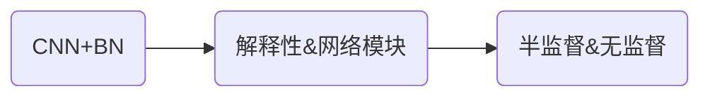

# 主要方法

 

基于上文的噪音成因，目前用于图像去噪的算法大致可以分为三类[14]：

 

- 基于滤波器的方法
 

- 基于模型的方法
- 基于学习的方法

<Footnotes separator>
    <Footnote>主要方法</Footnote>
</Footnotes>

---
transition: slide-left
---

## 基于滤波器的方法

这些滤波器方法都有一个假设，即图像的像素值具有空间相关性，可以基于一个像素的周边像素来进行该像素的修正。

 

**经典方法**

 

- 中值滤波[16]
 
- 自适应维纳滤波[17]

 

<v-click>

对于模式简单的噪音，比如人工噪音，椒盐噪音，这类方法一般都能有很好的效果。

</v-click>

<Footnotes separator>
    <Footnote>基于滤波器的方法</Footnote>
</Footnotes>

---
transition: slide-left
---

**滤波的方法的缺点**
 

<v-click>

1. 容易造成轮廓退化：滤波器操作容易对图像的中阶信息，比如轮廓造成损害。使得去噪后的图像的信噪比进一步降低。

</v-click>

 

<v-click>

2. 泛化性能差：基于滤波器的方法对于不同模式的噪音输入会表现出很差的效果。

</v-click>

 

<v-click>

3. 可拓展性差： 滤波器的参数需要手动设置，对于不同分辨率的图片需要设计新的滤波器。

</v-click>

 

<Footnotes separator>
    <Footnote>基于滤波器的方法</Footnote>
</Footnotes>

---
transition: slide-left
---

## 基于模型的方法
 

基于模型的方法往往通过某种对于图像的先验假设，对图像信号的响应过程进行数学建模。对于建立模型进行优化问题的求解。

 

**代表方法**

<v-click>

- 低秩聚类[18]
 

- 图拉普拉斯正则化[19]
- 基于小波变换的去噪模型[20]
- 基于马尔可夫随机场的去噪模型[21]

</v-click>

<Footnotes separator>
    <Footnote>基于模型的方法</Footnote>
</Footnotes>

---
transition: slide-left
---

**基于模型的方法的缺点**
 
 

<v-click>

1. 优化问题的求解一般都很困难

</v-click>

 

<v-click>

2. 通过迭代进行优化会大大加大去噪算法的时间复杂度，对于一些有实时性要求的应用而言，这是不可接受的。

</v-click>

 

<v-click>

3. 优化模型的简化会使得最终的去噪效果不理想。

</v-click>

<Footnotes separator>
    <Footnote>基于模型的方法</Footnote>
</Footnotes>

---
transition: slide-left
---

## 基于学习的方法
 

**简介**

近十年来，随着深度学习特别是深度卷积神经网络在各个计算机视觉领域的成功，图像去噪领域的 SOTA 模型也基本都被深度学习取代[22]。

 

<v-click>

> 相比于基于滤波的方法：基于深度学习的具有更好的泛化性，且基于滤波的方法的表达范围是深度卷积网络的子集，因此，只要实验设计得当，基于深度学习的图像去噪算法可以表现得不比滤波器差。

</v-click>

 

<v-click>

> 相比于基于模型的方法：优化深度卷积网络的可行性更高，方案更多。

</v-click>

 
 

<v-click>

</v-click>
<Footnotes separator>
    <Footnote>基于学习的方法</Footnote>
</Footnotes>

---
transition: slide-left
---
**发展时间线**

在 2012 年，张等人就通过设计基于 CNN+BN+ReLU 的经典结构，实现了去噪算法[23]。不过 CNN 天然具有图像局部性，也就是感受野不大的缺点。为了克服感受野低的问题，膨胀卷积[24]，非局部操作[25] 等模块被提出来用于改进卷积网络的网络结构。
 
 

<v-click>

后续的大量的去噪网络都从解释性和一些对于网络模块的假设出发，从网络架构出发进行优化，比较有代表性的工作有：DnCNN[26]、FFDNet[27]、CBDNet[28]。

</v-click>

 

<v-click>

构造合理噪音-干净图的配对数据的在部分领域很困难，使得无监督、半监督的方法别提出来，如 Noise2Noise[9]，Neighbor2Neighbor[29]。

</v-click>

<Footnotes separator>
    <Footnote>发展时间线</Footnote>
</Footnotes>

---
transition: slide-left
---
## 去噪数据集与指标

**基于高斯白噪声**

- Set12[26]，BSD68[30] ，Urban100[31]

**真实噪音数据集**

- DnD[32]、SIDD[33] 、RNI15[34]

<Footnotes separator>
    <Footnote>去噪数据集</Footnote>
</Footnotes>

---
layout: figure-side
figureCaption: 使用提示词 robot, playing guitar 通过Stable Diffusion生成的图
figureUrl: https://picx.zhimg.com/80/v2-8dd65a472a91988d8d9793a4b47c3ee5_1440w.png 
transition: slide-left
---

## 扩散模型

扩散模型 (Diffusion) 是一类近年来非常热门的图像生成算法，在多模态图像生成，图像语义编辑，超分辨率重建，图像翻译等诸多计算机视觉领域取得了令人印象深刻的结果[35]。与传统生成算法 GAN[36]，VAE[37]相比，扩散模型能够更好地学习样本的特征分布。而时下热门的图像生成软件，DALLE 和 NovelAI 基于扩散模型也都取得了非常好的效果，使得基于深度学习的图像创造应用在公众的传播达到了前所未有的程度。

<Footnotes separator>
    <Footnote>扩散模型</Footnote>
</Footnotes>

---
transition: slide-left
---

openai 的论文也证明了扩散模型相比于 GAN，在生成结果上有更好的效果。但是，扩散模型 DDPM 仍然有两个比较大的问题：

 

<v-click>

1. 推理速度缓慢，内存占用大：相比于 GAN 和 VAE，扩散模型无论是模型大小还是推理速度，都更大更慢。这使得扩散模型的实时性推理存在挑战性。

> 针对该问题，许多从扩散模型的概率学模型出发，通过减少扩散模型的采样次数来加速扩散模型的推理速度，其中比较有代表性的工作有： DDIM[39]、Dpm-solver[40]、Dpm-solver++[41]。

</v-click>

 
 

<v-click>

2. 结果控制性差：扩散模型 DDPM 的随机性太强，无法[38]生成稳定的受控图像。

> 针对该问题：有不少的工作在研究如何使用扩散模型进行受控图像生成：Ilvr[38]、SDEEdit[42]、RePaint[43]。这些方法可以全局或者局部地进行生成图像的控制。

</v-click>

<Footnotes separator>
    <Footnote>扩散模型</Footnote>
</Footnotes>

---
layout: figure-side
figureUrl: https://pic1.zhimg.com/80/v2-036fd5a00e9b3b2c7ec3ace8a5f229a1_1440w.png
figureCaption: Deep unsupervised learning using nonequilibrium thermodynamics 中的 noise inpaint 实验
transition: slide-left
---

## 扩散模型去噪研究

由于扩散模型正向会将原图加噪成一个接近高斯噪音的图，再进行去噪，这个过程天然地与图像去噪有着类似的形式。且在扩散模型最早的一篇文章[44] 中，作者在最后的实验中也展示了扩散模型进行 noise inpaint 的能力，虽然这个实验并不是完整的图像去噪，但是，证明了基于扩散模型的图像去噪在形式上是可能的。

目前基于扩散模型的图像去噪方面的研究还不是很多，从 2020 年开始，基于扩散模型单纯做图像去噪的文章在 google 学术中只找到了[45]。主要的难点在于数据集的设计和输出图像的控制。因此，基于扩散模型进行图像去噪有比较大的研究空间。

<Footnotes separator>
    <Footnote>扩散模型去噪研究</Footnote>
</Footnotes>

