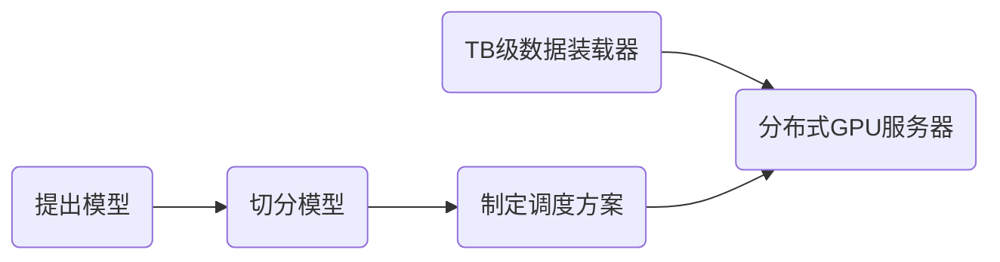
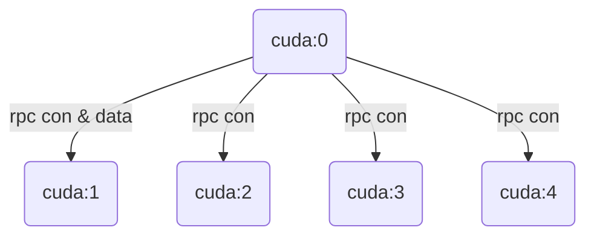
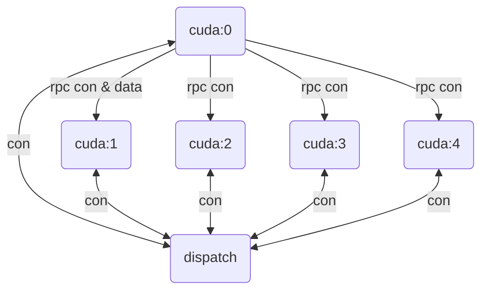

# 实习答辩
## Colossalai 流水线并行框架开发

---
layout: table-of-contents
hideInToc: true
transition: slide-left
---
# 目录

---
transition: slide-left
layout: figure-side
figureUrl: https://picx.zhimg.com/80/v2-bce05c000ed87eb1a910e2c6c02ba648_1440w.png
figureCaption: 这篇slidev的outline是用new bing生成的
---

# 实习项目背景

- 随着chatgpt, new bing等 LLM 的爆火，现代社会的生产力将得到进一步的解放，这将成为IT领域新的划时代技术，值得关注。

 

<v-click>

- 大规模深度学习模型训练需要大量的计算资源和内存空间，比如chatgpt需要320G显存。加上训练的activation，torch context，block allocation分配机制，batch size（32）等开销，理论上单卡训练chatgpt需要至少需要 320×(2 + batch_size + optimizer)的显存。目前显存最大的量产计算卡为英伟达的A100，是80个G。那么工程上要如何实现训练与部署chatgpt呢？

</v-click>

<Footnotes separator>
    <Footnote>实习项目背景</Footnote>
</Footnotes>

---
transition: slide-left
---

**实习项目背景**

为了解决单张显卡/加速器无法存下 LLM 的窘急，各个研究机构开始采用“流水线并行”(Pipeline Parallel)作为解决方案

基本想法与CPU设计中的多级流水线类似：

   

 

> new bing给出的回答：流水线并行是一种将神经网络切分成多个阶段，并将不同阶段映射到不同设备上执行的方法，以节省内存开销

<Footnotes separator>
    <Footnote>实习项目背景</Footnote>
</Footnotes>

---
transition: slide-left
---

# 竞品简介

- Colossalai 老API
- PiPPy
- OneFlow

<v-click>

有如下缺点：
- 可拓展性差，难以快速构建新的流水线并行算法
- 通讯效率有待提高
- 部分没有采用RMDA技术

</v-click>

<Footnotes separator>
    <Footnote>竞品简介</Footnote>
</Footnotes>

---
transition: slide-left
---

# 大型神经网络模型装载流程图

正式开始讲解我的工作前，有必要科普一下现代大型神经网络装载全流程：
 

 
 

<v-click>

- 切分模型(sharding)：包括神经网络负载估计、神经网络内存大小估计，随机拓扑结构切分算法（NP难）
- 制定调度算法(dispatch)：如何高效地制定并行算法来调度各个sharding（我的工作）
- TB级数据装载器(loader)：如何设计交互策略来减少装载海量数据时换入换出的次数

</v-click>

 

<v-click>

额外的优化策略：数据并行，张量并行，零容忍优化器......

</v-click>

<Footnotes separator>
    <Footnote>大型神经网络模型装载流程图</Footnote>
</Footnotes>

---
transition: slide-left
layout: figure-side
figureUrl: https://picx.zhimg.com/80/v2-05232725cb49e5f3b52dd12b0edd28a2_1440w.png
figureCaption: 1F1B调度图
---

# 实习项目目标

- 为Colossalai的上游算法设计并开发一套高性能与高可拓展性的流水线调度框架
 

- 基于这个框架实现几种最新的流水线并行算法，GPipe、1F1B、overleaved 1F1B、Chimera，并与竞品框架(PiPPy)进行性能评估和对比分析

<Footnotes separator>
    <Footnote>实习项目目标</Footnote>
</Footnotes>

---
transition: slide-left
---

# 实习项目主要工作和贡献

- 设计并实现了基于RMDA通信协议和nccl库的去中心化RPC调度框架。
 

- 实现调度框架高可拓展性，只需要提供相邻sharding的依赖关系即可快速实现新的流水线并行算法。
- 实现了PipeDream、GPipe等几种流水线并行算法，并成为首个实现Chimera的开源框架，并与PiPPy不同规模和配置下进行了性能测试和对比分析，在Resnet，Bert上比竞品调度每秒处理的批数据数量多50%。

<Footnotes separator>
    <Footnote>实习项目主要工作和贡献</Footnote>
</Footnotes>

---
layout: two-cols
transition: slide-left
---

# 去中心化调度方案设计思路

<Footnotes separator>
    <Footnote>去中心化调度方案设计思路</Footnote>
</Footnotes>

 

建立RPC连接和初始数据传递关系。

::right::

 
 
 
 
 

<v-click>

</v-click>

---
layout: cover
class: text-white text-center
coverBackgroundUrl: 
hideInToc: true
transition: slide-left
---
# 感谢观看
## Q&A