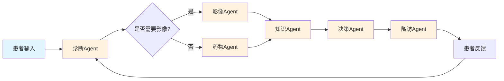

# 组会报告
## AI Agent Survey

---
layout: figure-side
figureUrl: https://d1oupeiobkpcny.cloudfront.net/user_upload_by_module/markdown/310708716691272617/OhdKxGRSXCcuqOvz.png
transition: slide-left
---

## Manus Blog

### Design Around the KV-Cache

 

- 直接影响延迟和成本（10倍差异）
- 平均输入与输出的token比例约为100:1
- 缓存输入: $0.30/百万token vs 未缓存: $3/百万token

**关键实践:**
1. 保持提示前缀稳定
2. 使上下文只追加
3. 明确标记缓存断点

---
layout: figure-side
figureUrl: https://d1oupeiobkpcny.cloudfront.net/user_upload_by_module/markdown/310708716691272617/cWxINCvUfrmlbvfV.png
transition: slide-left
---

## Manus Blog

### Mask, Don't Remove

 

**问题：**
- 工具数量爆炸式增长（MCP协议加剧）
- 动态添加/移除工具会破坏KV缓存
- 模型困惑和幻觉动作

**解决方案：**
使用上下文感知的状态机管理工具可用性
- 不移除工具，而是遮蔽token的logits
- 基于当前上下文阻止/强制选择特定动作
- 保持代理循环稳定

---
layout: figure-side
figureUrl: https://d1oupeiobkpcny.cloudfront.net/user_upload_by_module/markdown/310708716691272617/sBITCOxGnHNUPHTD.png
transition: slide-left
---

## Manus Blog

### Use the File System as Context

**传统痛点：**
- 128K+上下文仍可能不够
- 长上下文性能下降
- 成本高昂

**Manus解决方案：**
将文件系统视为终极上下文
- 大小不受限制，天然持久化
- 代理可直接操作文件系统
- 可恢复的压缩策略

**设计原则：**
- 始终可恢复的信息压缩
- 外部化长期状态而非保存在上下文中

---
layout: figure-side
figureUrl: https://d1oupeiobkpcny.cloudfront.net/user_upload_by_module/markdown/310708716691272617/OYpTzfPZaBeeWFOx.png
transition: slide-left
---

## Manus Blog

### Manipulate Attention Through Recitation

**现象：**
Manus在处理复杂任务时会创建todo.md文件并持续更新

**机制：**
- 平均需要约50次工具调用
- 通过重写待办事项将目标推入近期注意力范围
- 避免"丢失在中间"问题

**效果：**
- 使用自然语言偏向任务目标
- 减少目标不一致
- 无需特殊架构变更

---
layout: figure-side
figureUrl: https://d1oupeiobkpcny.cloudfront.net/user_upload_by_module/markdown/310708716691272617/dBjZlVbKJVhjgQuF.png
transition: slide-left
---

## Manus Blog

### Keep the Wrong Stuff In

**常见错误：**
- 隐藏失败痕迹
- 重试操作并清理状态
- 依赖"温度"参数

**正确做法：**
- 将错误尝试保留在上下文中
- 模型通过观察失败隐式更新信念
- 降低重复相同错误的可能性

**关键洞察：**

错误恢复是真正代理行为的最明显指标之一

---
layout: figure-side
figureUrl: https://picx.zhimg.com/80/v2-1a827f99364a177c16fea34ebbb9bce6_1440w.png
transition: slide-left
---

## MCP Zero: 主动工具搜索

### 扩展到2797个工具的突破

**论文:** https://www.alphaxiv.org/abs/2506.01056v4

**核心创新:**
- **零样本工具使用**: 无需训练即可使用新工具
- **主动搜索机制**: 从2797个工具中智能选择
- **上下文学习**: 基于工具描述和示例快速适应

---
layout: default
transition: slide-left
---

## MCPBench: 工具使用评估框架

### 标准化AI Agent工具能力评估

**论文:** https://www.alphaxiv.org/abs/2504.11094

**评估维度:**
- **工具选择准确性**: 从候选集中选择正确工具
- **参数填充质量**: 正确理解和填充工具参数
- **序列规划能力**: 多工具组合使用
- **错误恢复机制**: 处理工具调用失败

Agent Benchmark: https://github.com/modelscope/MCPBench

---
layout: default
transition: slide-left
---

## 群医学Agent架构设计

### 六个专业化Agent的协同系统

基于A2A协议构建的群医学Agent架构，包含六个专业领域Agent，通过标准化协议实现紧密协作：

- **诊断Agent**: 症状分析与初步诊断
- **影像Agent**: 医学影像解读与报告
- **药物Agent**: 用药指导与相互作用检查
- **随访Agent**: 患者管理与健康监测
- **知识Agent**: 医学知识库查询与更新
- **决策Agent**: 综合决策支持与方案推荐

---
layout: default
transition: slide-left
---

## 群医学Agent架构流程图

### 自上而下的架构设计
 

 

- mcp server: 一个节点，一个 Agent
- mcp tool: 子模型
- agent 之间连接：A2A

---
layout: cover
transition: slide-left
---

## Thanks

### Q&A

**参考资料**

- Manus Blog: https://manus.im/blog/Context-Engineering-for-AI-Agents-Lessons-from-Building-Manus
- MCP Zero: https://www.alphaxiv.org/abs/2506.01056v4
- MCPBench: https://github.com/modelscope/MCPBench
