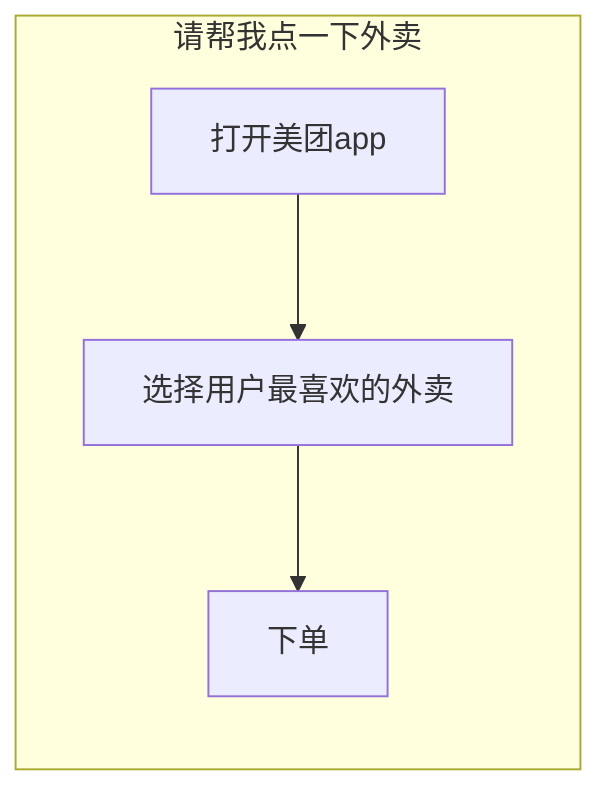
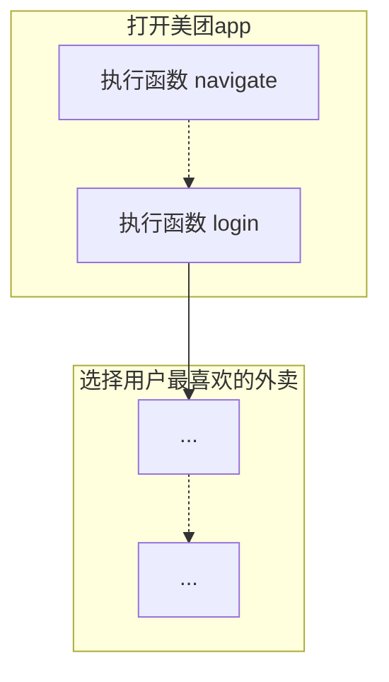
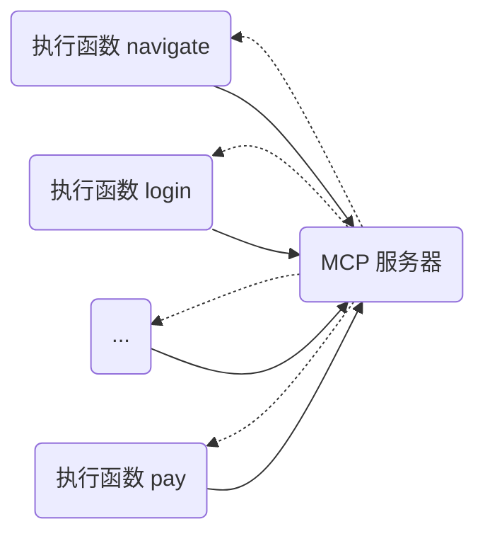
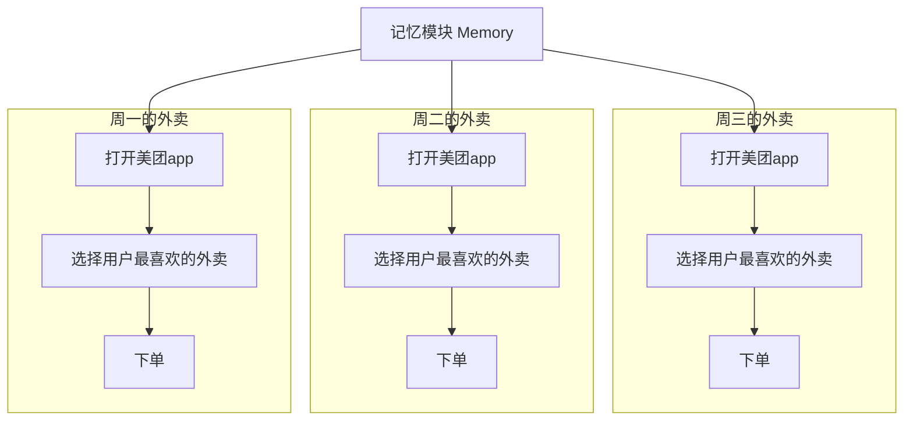

# Un AI Share

<h2 class="text-primary">用 AI Agent 来封装你的记忆和知识</h2>

---
layout: figure-side
transition: slide-left
figureUrl: https://pic1.zhimg.com/80/v2-9a0b6e0ee617ae4e12ef22c628ff8451_1440w.png
---

## 自我介绍

黄哲龙

- 中科大在读研究生
- 字节豆包算法实习生
- Digital IDE / OpenMCP 作者，参与分布式大模型训练系统 ColossalAI 开发
- 以「锦恢」为 ID 活跃在知乎等平台

个人网站：https://kirigaya.cn

---
layout: figure-side
figureUrl: https://picx.zhimg.com/80/v2-4c0f48ae7b5a52df47c171aa4c61168b_1440w.png
transition: slide-left
---

## 大模型时代，人们的关注点
**2022年开始的故事**

2022 年，我还在 CA 实习，当年12月份，chatgpt横空出世，时至今日，chatgpt，deepseek，kimi，grok 等等模型百花齐放。


<v-click> 而去年 openai 和 grok 的实验证明了大模型的 pretrained scaling law 到头了，堆砌参数量的游戏快要结束了。 </v-click>

---
layout: default
transition: slide-left
---

## 大模型时代，人们的关注点

**聪不聪明**

最初大家为一个个 demo 而欢呼雀跃，很少有人会问一个问题：

<v-click>
  <div class="text-3xl mt-20 font-bold text-primary px-8 py-6 bg-primary/5 rounded-lg border-2 border-primary/30 shadow-lg mx-auto max-w-3xl leading-relaxed">
    你的工作时间真的因为大模型的出现而下降了吗？
  </div>
</v-click>

---
layout: default
transition: slide-left
---

## 大模型时代，人们的关注点
**有没有用**

我不否认大模型的文字游戏，给我们带来的情绪价值，但是当热潮褪去后，越来越多人的开始发出质问，便有了推特上非常有名的一句话：

<v-click>
  <div class="text-3xl mt-16 font-bold text-primary px-8 py-6 bg-primary/5 rounded-lg border-2 border-primary/30 shadow-lg mx-auto max-w-3xl leading-relaxed">
    告诉我有没有用，而不是聪不聪明

> Instead of smart or not smart, think useful or not useful
  </div>
</v-click>

---
layout: figure
transition: slide-left
figureUrl: https://picx.zhimg.com/80/v2-666230ae51991523132dbf1d6f51b355_1440w.png
figureCaption: Agent 一词源于强化学习，代表一个可以和环境进行交互的系统，它和目前 AI Agent 的真实含义其实略有不同
---

## 什么是 AI Agent ？
**Agent 一词并非源于大模型**

---
layout: default
transition: slide-left
---

## 什么是 AI Agent ？
**我们如何把科幻电影搬到现实生活？**


---
layout: default
transition: slide-left
---

## 什么是 AI Agent ？
**AI Agent = ? + ?**

如果你真的要定义什么是 AI Agent，定义一个技术路线，而非一个无聊的概念，那么我认为，用下来的等式足以定义目前的 Agent

<v-click>
  <div class="text-3xl mt-20 font-bold text-primary px-8 py-6 bg-primary/5 rounded-lg border-2 border-primary/30 shadow-lg mx-auto max-w-3xl leading-relaxed">
    AI Agent = 大模型 + 规划模块 + 动作模块 + 记忆模块
  </div>
</v-click>

---
layout: default
transition: slide-left
---

## AI Agent 三大核心组件
**AI Agent = ? + ?**

- 规划模块 Planning

- 动作模块 Action
- 记忆模块 Memory

---
layout: two-cols
transition: slide-left
---

## 一个例子: 点外卖的 Agent
**规划模块 Planning**

假设，我们设计了一个管家 agent。

那么我现在告诉它：“请帮我点一下外卖”，那么管家 agent 首先会先进行 planning

::right::



---
layout: two-cols
transition: slide-left
---

## 一个例子: 点外卖的 Agent
**动作模块 Action**

比如对于 “打开美团app” 这个子任务，action 的输出是如下的函数的执行队列.

也就是先导航到 https://外卖.com ，然后使用锦恢为ID进行登陆。

::right::



---
layout: two-cols
transition: slide-left
---

## 一个例子: 点外卖的 Agent
**动作模块 Action**



::right::

从技术实现来说，很多开源项目其实把这个称为一个 「AI Agent」

---
layout: default
transition: slide-left
---

## 一个例子: 点外卖的 Agent
**记忆模块 Memory** 



---
layout: default
transition: slide-left
---

## AI Agent 三大核心组件
**技术进展**

### 规划模块 Planning

planning 很难，恐怕需要使用专业的 planning 数据集训练特化大模型，牺牲一部分大模型什么都知道的能力到什么都会做的能力。核心技术如下：

- Planning Dataset
- HIL: Human in loop

---
layout: default
transition: slide-left
---

## AI Agent 三大核心组件
**技术进展**

### 动作模块 Action

在设计边界（design boundary）设计明确的情况下，基于 MCP 的方案可以多块好省地快速把一堆现成的功能函数封装为 MCP。

<v-click>
  <div class="text-3xl mt-20 font-bold text-primary px-8 py-6 bg-primary/5 rounded-lg border-2 border-primary/30 shadow-lg mx-auto max-w-3xl leading-relaxed">
    MCP 服务器 + MCP 客户端 = 动作模块 Action
  </div>
</v-click>

---
layout: figure
figureUrl: https://pica.zhimg.com/80/v2-ebb223d2d2be3403a22f9dd437b75eb0_1440w.png
figureCaption: https://kirigaya.cn/openmcp/
transition: slide-left
---

## AI Agent 三大核心组件
**技术进展**

---
layout: default
transition: slide-left
---

## 技术进展
**记忆模块 Memory**

只是「记忆」的话使用 RAG 的方案可以解决（openmemory）

<div align=center>

</div>

---
layout: default
transition: slide-left
---

## 一些实践
**Slidev MCP**

slidev 是一个可以把 markdown 转换为精美在线 PPT 的工具。

但是因为如下原因，导致一直无法普及

1. 使用门槛高：需要使用严格的 yaml 字段配置页面
2. 心智负担重：需要边写 markdown 边预览效果

如诸位所见，这次分享会的 ppt 就是基于 slidev mcp 生成。

---
layout: default
transition: slide-left
---

## 一些实践
**Slidev MCP**

<div align=center>

<p class="img-caption">bit-ui 官方文档</p>
</div>

---
layout: default
transition: slide-left
---

## 一些实践
**Slidev MCP**

```md
---
layout: default
transition: slide-left
---

## 大模型时代，人们的关注点

**聪不聪明**

最初大家为一个个 demo 而欢呼雀跃，很少有人会问一个问题：

<v-click>
  <div class="text-3xl mt-20 font-bold text-primary px-8 py-6 bg-primary/5 rounded-lg border-2 border-primary/30 shadow-lg mx-auto max-w-3xl leading-relaxed">
    你的工作时间真的因为大模型的出现而下降了吗？
  </div>
</v-click>
```

---
layout: default
transition: slide-left
---

## 一些实践
**Slidev MCP**

```python
@mcp.tool(
    name='set_page',
)
def set_page(index: int, content: str, layout: str = "") -> SlidevResult:
    global SLIDEV_CONTENT
    
    template = f"""
---
layout: {layout}
transition: slide-left
---

{content}

""".strip()
    
    SLIDEV_CONTENT[index] = template
    save_slidev_content()
    
    return SlidevResult(True, f"Page {index} updated", index)
```

---
layout: default
transition: slide-left
---

## 一些实践
**Slidev MCP**

<div align=center>

</div>

---
layout: default
transition: slide-left
---

## 一些实践
`TIP` : 我运作了两年的私人辅助智能体，为我完成咨询收集、简单问题回复、软件的编译和分发，大部分功能基于 MCP 进行封装

<div align=center>

</div>

---
layout: default
transition: slide-left
---

## 一些实践

`TIP`


<div align=center>

</div>

---
layout: default
transition: slide-left
---

## 一些实践
**llm.txt**

我观察到，部分国外软件文档开始出现 llm.txt 了，这是一段专门给大模型观看的 prompt 文本，大模型阅读文本后就能知道如何使用当前的软件或者框架

<div align=center>

<p class="img-caption">bit-ui 官方文档</p>
</div>

---
layout: default
transition: slide-left
---

## 一些实践
**llm.txt 会是趋势吗？**

你写的文档用户不看？

<div align=center>

<p class="img-caption">bit-ui 官方文档</p>
</div>

---
layout: default
transition: slide-left
---

## 一些实践
**llm.txt 会是趋势吗？**

部分文档，转化成 MCP ？

用 AI Agent 拉进用户和我们的距离。

用 MCP 提前封装软件开发者的认知。

---
layout: cover
transition: slide-left
---

# Thanks

Q&A

邮箱：1193466151@qq.com

微信：lstmkirigaya

个人网站：https://kirigaya.cn

OpenMCP: https://kirigaya.cn/openmcp
