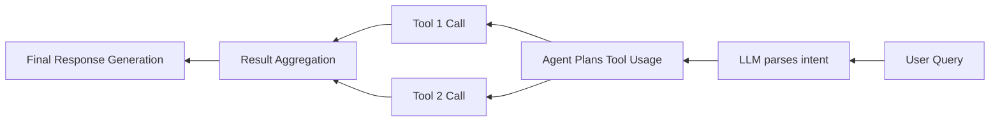
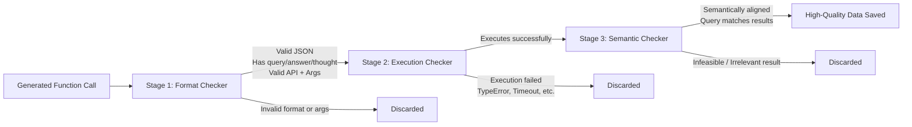

# Paper Reading

## APIGen: Automated Pipeline for Generating Verifiable and Diverse Function-Calling Datasets

---
transition: slide-left
---

## Tool Usage: LLm -> Agent

**Background & Current Status**

* LLMs can autonomously invoke tools (e.g., weather APIs, calculators, databases, REST APIs), enabling real-time code execution ([proceedings.neurips.cc][1]).
* Widely applicable across domains like social networking, finance, travel, etc.

---
transition: slide-left
---

## Tool Usage: LLm -> Agent

**Major Challenges**

* **Data Quality**: Training data is static, noisy, and lacks accurate execution results.
* **Generalization to Unseen APIs**: Poor adaptability to new APIs.
* **Complex Calling Chains**: Difficulties with parallel/serial calls and semantic dependencies.

New Problems: Lack of function calling

---
transition: slide-left
---

## Prior Work on Tool-Using Agents & Datasets

**Representative Work**

* Toolformer: Fine-tunes LLMs to invoke tools like QA, calculator, and search ([arxiv.org][2]).
* RestGPT, xLAM, Octopus-v4, Gorilla: Multi-stage tool-using agents ([proceedings.neurips.cc][1]).
* Existing datasets: AgentInstruct, APIBank, Toolalpaca, ToolBench, etc.

 
 
 

---

## Shortcomings in Existing Work

* **Lack of Validation**: Many datasets are auto-generated without execution or semantic checks — high noise.
* **Limited Scale**: Too few API types or calling scenarios.
* **Lack of Call Chain Complexity**: No support for realistic multi-function chains (e.g., parallel/serial usage).

---

## APIGen: A New Approach to Address These Gaps

**Core Contributions**

* Proposes APIGen — an automated pipeline with three-stage verification: format, execution, and semantic validation ([proceedings.neurips.cc][3]).
* Collects 3,673 executable APIs across 21 categories, generating 60,000 high-quality samples.

---

## APIGen: A New Approach to Address These Gaps

**Verification Strategies**

1. **Format Checking**: Ensures JSON, function signatures, etc., are valid.
2. **Live Execution**: Executes real API calls to validate responses.
3. **Semantic Matching**: Checks if the response aligns with the natural language prompt.

 
 
 

---

## Experiment

**Main Objectives**

- How much can the generated data improve a model's function-calling capabilities?

- How effective is the APIGen framework in filtering out low-quality data?

---

## Experiment

**Experimental Approach**

Two base models were trained:
- DeepSeek-Coder-1.3B-instruct
- DeepSeek-Coder-7B-instruct-v1.5

Both used the xLAM (Large Action Model) training pipeline.

Resulting models are named:
- xLAM-1B (FC)
- xLAM-7B (FC)

---

## Experiment

**Comparison Targets**

Benchmarked against several state-of-the-art models:
- GPT-4 series (e.g., GPT-4o)
- Claude-3 series
- Gemini series
- LLaMA3
- Mixtral
- OpenFunctions-v2
- Command R+, etc.

---

## Experiment

**Comparison Targets**

> NOTE: DeepSeek-Coder-v1.5 ranks 45th

---

## Experiment

**Ablation Study**

---

## Outlook: Towards MCP (Multi‑Call Planning)

**Future Directions**

* **Nested Call Chains**: Supports complex multi-level API usage. NESTFUL shows current accuracy is only 25% ([arxiv.org][5]).
* **Dialogue-Level Evaluation**: CONFETTI evaluates multi-turn function-calling, which still underperforms ([arxiv.org][6]).
* **MCP Vision**: Toward agents that plan multi-round, hybrid API calls with consistent intent understanding and logic.

---

## MCP

**What is MCP**

[OpenMCP](https://kirigaya.cn/openmcp/)

---

## MCP

**Drawbacks**

- Lack of metrics
- Lack of design boundary (What it can do and can't)
- How to combine different mcp servers ? (tool description align)

---

## Reference

[1] https://proceedings.neurips.cc/paper_files/paper/2024/file/61cce86d180b1184949e58939c4f983d-Paper-Datasets_and_Benchmarks_Track.pdf

[2] https://arxiv.org/abs/2409.00920

[3] https://proceedings.neurips.cc/paper_files/paper/2024/hash/61cce86d180b1184949e58939c4f983d-Abstract-Datasets_and_Benchmarks_Track.html

[4] https://arxiv.org/abs/2406.18518

[5] https://arxiv.org/abs/2409.03797

[6] https://arxiv.org/abs/2506.01859

